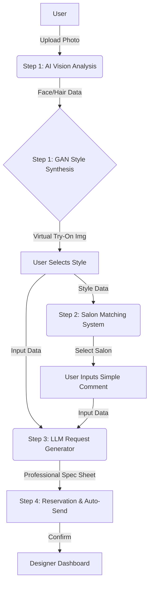

# 💇‍♀️ Dear Cut (디어컷)

> **"고민 없이 예약, 설명 없이 완성"** \> AI 기반 헤어스타일 컨시어지 & 매칭 플랫폼

  

## 📖 프로젝트 소개 (Project Overview)

**Dear Cut**은 사용자의 스타일링 고민과 디자이너의 소통 오류를 해결하는 **AI 기반 미용실 예약/매칭 서비스**입니다.
Vision AI와 LLM 기술을 활용하여 사용자의 얼굴형과 모발 상태를 분석하고, 가상 스타일링(Virtual Try-On)을 제공하며, 비전문가의 추상적인 요구사항을 **전문가용 시술 요청서**로 자동 변환하여 디자이너에게 전달합니다.

## 🚀 핵심 기능 (Key Features)

### 1\. AI 스타일링 분석 및 시각화 (Personalization Engine)

사용자의 현재 상태를 초정밀 분석하고, 최적의 스타일을 시각적으로 제안합니다.

  * [cite_start]**Vision AI 분석:** 사진 한 장으로 얼굴형, 이목구비 비율, 모발 손상도(상/중/하)를 분석합니다[cite: 3, 4].
  * [cite_start]**GAN 기반 가상 스타일링:** 분석 데이터와 트렌드를 결합해 가장 잘 어울리는 스타일 5가지를 추천하고, 사용자 얼굴에 합성(Virtual Try-On)하여 보여줍니다[cite: 5, 6].
  * [cite_start]**현실적 조언:** "곱슬이 심해 관리가 어렵습니다"와 같은 스타일별 제약 조건을 미리 안내합니다[cite: 7].

### 2\. 스마트 미용실 매칭 (Booking Engine)

단순 위치 기반이 아닌, '내가 원하는 스타일'을 가장 잘하는 디자이너를 찾아줍니다.

  * [cite_start]**스타일별 전문 매칭:** 레이어드 컷, 옴브레 등 특정 시술에 대한 포트폴리오 데이터를 기반으로 미용실을 추천합니다[cite: 10, 11].
  * [cite_start]**다중 필터링:** 거리순, 평점순은 물론 **'AI 추천 스타일 시술 건수'** 기준으로 정렬 가능합니다[cite: 12].
  * [cite_start]**실시간 예약:** 빈 시간표를 확인하고 원클릭으로 예약을 진행합니다[cite: 14].

### 3\. LLM 기반 요청서 자동 생성 (AI Communicator)

"대충 이런 느낌으로..."라는 모호한 표현을 전문적인 작업지시서로 변환합니다.

  * [cite_start]**자연어 처리(NLP):** 사용자가 입력한 "앞머리 짧게, 톤 다운" 같은 간단한 코멘트와 합성 이미지를 분석합니다[cite: 17].
  * [cite_start]**전문 용어 변환:** LLM이 이를 해석하여 미용 전문가가 이해할 수 있는 구체적인 시술 요청서를 작성합니다[cite: 19].
  * [cite_start]**주의사항 자동 기입:** 1단계에서 분석된 모발 손상도 등의 정보가 디자이너 주의사항으로 자동 포함됩니다[cite: 21].

### 4\. 자동화된 예약 및 전송 (Automated Service)

예약과 동시에 시술 준비를 마칠 수 있도록 정보를 동기화합니다.

  * [cite_start]**자동 전송 시스템:** 예약 확정 시, 생성된 AI 요청서가 디자이너의 대시보드나 메신저로 즉시 전송됩니다[cite: 27].
  * [cite_start]**사전 인지:** 디자이너는 고객 도착 전 얼굴형, 희망 스타일, 모발 상태를 미리 파악하여 시술 만족도를 극대화합니다[cite: 29].

## 🛠 시스템 아키텍처 (System Flow)



## 💻 기술 스택 (Tech Stack) (예시)

*(개발 진행 상황에 맞춰 수정 예정)*

  * **Frontend:** React Native (or Flutter) / Next.js
  * **Backend:** Python FastAPI / Django
  * **AI/ML:**
      * **Vision:** OpenCV, PyTorch (Face Analysis)
      * **Generation:** StyleGAN2 / Stable Diffusion (Virtual Try-On)
      * **NLP:** OpenAI API (GPT-4) or LangChain (Request Generation)
  * **Database:** PostgreSQL, Redis
  * **Infrastructure:** AWS (EC2, S3, Lambda)

## 📂 프로젝트 구조 (Directory Structure)

*(사용자님의 선호에 따라 모듈화된 구조 제안)*

```bash
DearCut/
├── backend/
│   ├── app/
│   │   ├── api/          # Endpoints (v1/analysis, v1/booking)
│   │   ├── core/         # Config, Security
│   │   ├── models/       # DB Models
│   │   ├── services/     # Business Logic (AI integration here)
│   │   └── schemas/      # Pydantic Schemas
│   └── ml_engine/        # Separate module for heavy AI models
├── frontend/
│   ├── src/
│   │   ├── components/   # Reusable UI components
│   │   ├── screens/      # App screens (Analysis, Booking, etc.)
│   │   └── hooks/        # Custom hooks
└── README.md
```

## 🏁 시작하기 (Getting Started)

1.  **Clone the repo**
    ```sh
    git clone https://github.com/your-username/dear-cut.git
    ```
2.  **Install Backend Dependencies**
    ```sh
    cd backend
    pip install -r requirements.txt
    ```
3.  **Run the Server**
    ```sh
    uvicorn app.main:app --reload
    ```